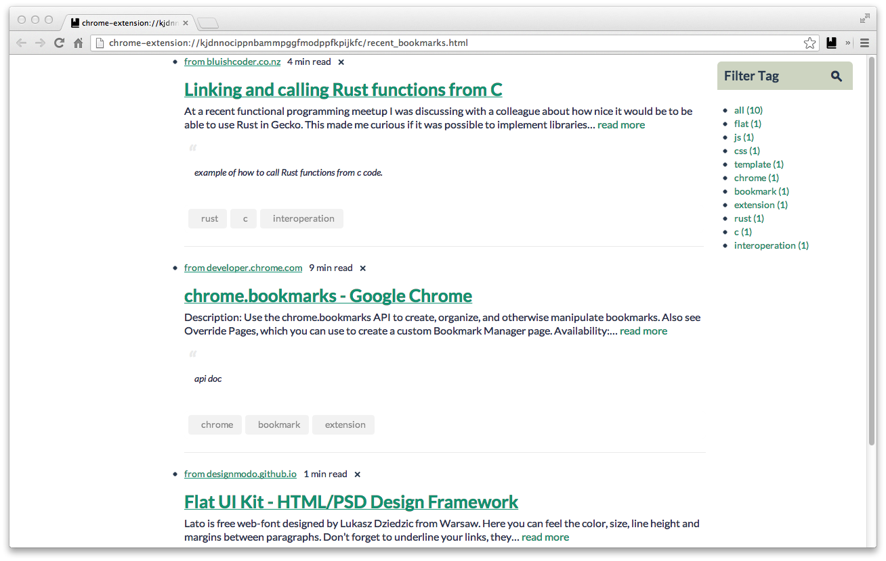

### What is BookmarkSpell?

BookmarkSpell is a lightweight, bookmark based knowledge management system, including:

* **A Chrome extension** <==(this repo)
* Android App (devloping)
* iOS App (developing)
* Website

### Why not delicious/Pocket/Readability/etc…?

* For fun
* Your data is kept both Chrome and Dropbox
* Intuitive, just hit Command+D

you can install from [Chrome Web Store](https://chrome.google.com/webstore/detail/hgimfomnnbecdjlndbhkcblaeoegpafn), if you have any comments please drop me a [email](mailto:hewigoven@gmail.com).

### How it works

1. OAuth Dropbox for datastore access
1. Listen to `chrome.bookmarks.onCreated`
3. Show a popup to fill your tags/notes
3. Integrate readability parser API to get full text
4. Add to Dropbox datastore(Actually -> [https://www.dropbox.com/developers/apps/datastores](https://www.dropbox.com/developers/apps/datastores))

### Build

	./build.sh

### Some screenshots

####Add tags/notes (Command+D or Click star icon on address bar)

####Desktop notifications

####Popup menu

####Show notes for this page

####Recent added bookmarks

####Full Text

### Todo List

* Better options page.
* Full text search.

### Credits

* [Flat UI Kit](http://designmodo.github.io/Flat-UI/)
* [sprintf.js](http://www.diveintojavascript.com/projects/javascript-sprintf)
* [SwitchySharp](https://code.google.com/p/switchysharp/source/browse/assets/styles/popup.css) Popup style
* [Mou](http://mouapp.com/) Blockquotes style
* Icon from [http://www.wpzoom.com](http://www.wpzoom.com/wpzoom/new-freebie-wpzoom-developer-icon-set-154-free-icons/)