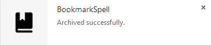

### What is Bookmark Spell?

Bookmark Spell is a chrome extension, is an idea of bookmark based automator:

	Input: -> url/bookmark 
		   -> under different folder
		   -> take different actions:
		   		-> Archive, add tags/notes/full text for your bookmark
		   		-> Download, download and sync to your dropbox folder
		   		-> Tweet, send a tweet!

### Why not delicious/Pocket/Readability/etc…?

* For fun
* Your data is kept both Chrome and Dropbox
* Intuitive, just hit Command+D

### How it works(take Archive as example)

1. OAuth Dropbox for datastore
1. Listen to `chrome.bookmarks.onCreated`
2. Check bookmark.parentId is Archive folder
3. Show a popup to fill your tags/notes
3. Integrate readability parser API to get full text
4. Insert to Dropbox(Actually -> [https://www.dropbox.com/developers/apps/datastores](https://www.dropbox.com/developers/apps/datastores))

### ScreenShots

####Step0: Install from [here](https://chrome.google.com/webstore/detail/hgimfomnnbecdjlndbhkcblaeoegpafn)

####Step1: Command+D

####Step2: 

####Step3: Check recent bookmarks

####Step4: 

####Step5: 

### Todo List

* Download folder
* Tweet folder
* Configurable as option page
* Hosted App to provide search functionally
* Mobile client

### Credits

* [Flat UI Kit](http://designmodo.github.io/Flat-UI/)
* [sprintf.js](http://www.diveintojavascript.com/projects/javascript-sprintf)
* [SwitchySharp](https://code.google.com/p/switchysharp/source/browse/assets/styles/popup.css) Popup style
* [Mou](http://mouapp.com/) Blockquotes style
* Icon from [http://www.wpzoom.com](http://www.wpzoom.com/wpzoom/new-freebie-wpzoom-developer-icon-set-154-free-icons/)